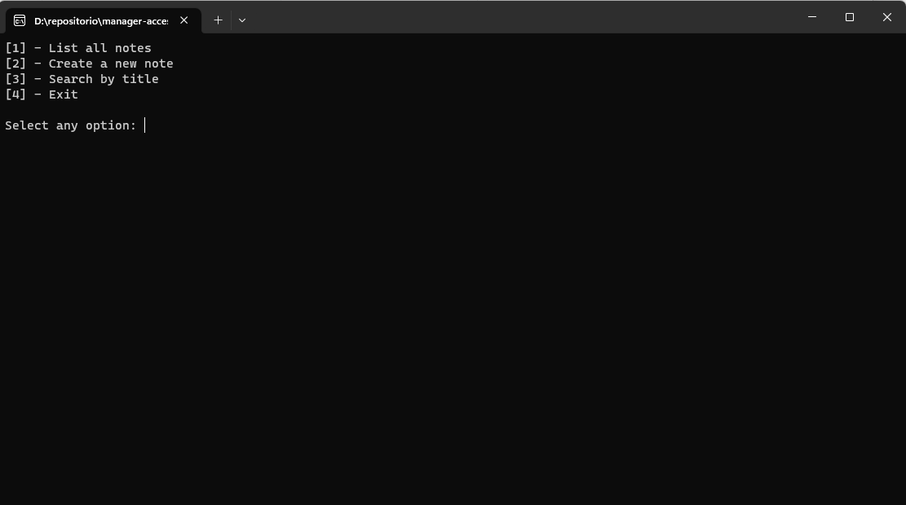
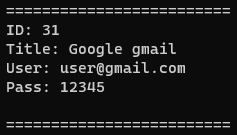

# Manager access
App written in C for personal use to save your access like as note.
Here you can put all information such title, user and pass of serverals web site and you can control all the informations.

### Stack
```
C
Windows 11
Linux
Shell
CodeBlocks: https://www.codeblocks.org/
```

**Execute tests**

Suit used
https://github.com/ThrowTheSwitch/Unity

*Linux*

If you are on linux, just execute on terminal the archive of test.

```shell
sh tests.sh
```

*Windows*

Just double click on executable `tests_windows.bat`, after of test has executed in double click on executable `clear-tests_windows.bat`

**It will execute all tests of system and on end clear all directories**

**Fist scream of system.**


That scream show all the options that the program can do.

Option | About
-------|------
`[1]`  | Just list all informations about your notes.
`[2]`  | Create a new note on system.
`[3]`  | Search on all notes that contain the word that was informed by user.
`[4]`  | Finish session. 

**Information format**



In this way, the information will be displayed.